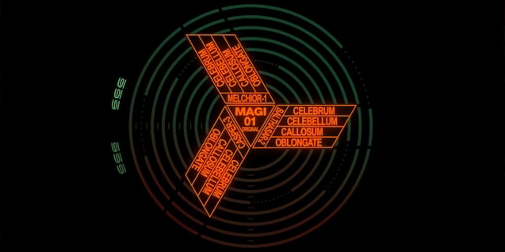

  
   
   
  <h1>L V N A C Y</h1>

  <i>Code at the intersection of Design</i> 
  <a href="https://blog.ephemeralrogue.xyz">L V N A C Y Code Blog</a>
  •
  <a href="https://discord.gg/nh7mqGEfbw">the L V N A C Y Discord Server</a>
  •
  <a href="https://bsky.app/profile/lvnacy.xyz">Bluesky</a>
   

 

 

  
  
  
  

 

<!-- Links -->
[fm-blog]: https://blog.ephemeralrogue.xyz
[madalexxx]: https://backstage.madalexxx.xyz
[LVNACY-bluesky]: https://bsky.app/profile/lvnacy.xyz
[Python]: https://www.python.org/
[Docker]: https://www.docker.com/
[vagrant]: https://developer.hashicorp.com/vagrant/docs
[Ansible]: https://www.ansible.com/
[SELinux]: https://github.blog/2023-07-05-introduction-to-selinux/
[Rust]: https://www.rust-lang.org/