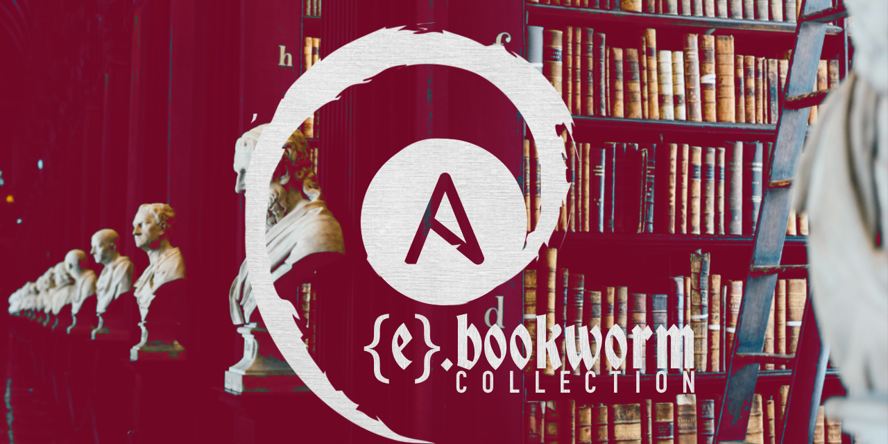

<h1 align="center">{ e }, <i>Soon to be L V N A C Y</i></h1>
 

  
  • >>> •
  
   
   
  <i>This is a moment of transition. 
    { e } is getting absorbed by L V N A C Y 
    The process will be complete in about 90 days
  </i>

 

  { e }: 
  <a href="https://blog.ephemeralrogue.xyz">personal dev blog</a>
  •
  <a href="https://discord.gg/nh7mqGEfbw">the { e } Discord Server</a>
  •
  <a href="https://bsky.app/profile/ephemeralrogue.xyz">Bluesky</a>
  •
  <a href="https://mastodon.social/@ephemeralrogue">Mastodon</a>
   

  L V N A C Y: 
  <a href="https://bsky.app/profile/lvnacy.xyz">Bluesky</a>
   

 

<h2 align="center">A Background, Sort of</h2>

I'm ephemeralrogue. but I'm also LVNACY. Over the past few years, I have 
instantiated a number of personas to compartmentalize specific projects and 
their sub-projects. { e } (ephemeralrogue) was born out of a need to create a 
silo in which I could learn and write code. Through {e } I have grown 
moderately competent in JS, markdown, Ansible, systems admin, and a touch of 
cybersecurity.

While {e} has proven to be an effective vehicle for learning and 
exploration, the time for its retirement has arrived. In the past year, the 
overlap between the code and design work in which I have involved myself has 
been growing, to the extent that it now seems far more efficient to marry the 
two.

What is code, if not the underlying design of systems and software?
What is design, if not the visual expression of systems programming across 
disciplines?

Whether or not we agree on this matters little, as all words and definitions 
are largely subjective. In my mind, the intersection between the two has grown 
such that it makes sesnse for me to merge them. { e } will be absorbed into 
LVNACY, and LVNACY will have .code and .design aspects, with a good amount of 
blending betwixt the two.

Anyway, enough blah blah blah about that for now. If you've stumbled across 
this, you're probably interested in what I'm building. Here are a few projects 
currently holding my attention:

 

  
  
  
  

 

Beyond this, I produce graphic design for the innumerable projects I have 
going on. Writing as [M A D • A L E X][madalexxx], I produce all graphics for 
the newsletter, site, and marketing, as well as design all ebooks. All 
graphics for { e } were produced under the L V N A C Y flag. Tag me in a post 
on [Bluesky][LVNACY-bluesky] for all inquiries.

<h2 align="center">Current Learning</h2>

When i'm writing code, i predominantly write backend JS, though I've been 
diving into sysadmin stuff. I'm currently spending my dev time learning the 
following systems and tools:
- [Python](https://www.python.org/)
- [Docker](https://www.docker.com/)
- [vagrant](https://developer.hashicorp.com/vagrant/docs)
- [Ansible](https://www.ansible.com/)
- [SELinux](https://github.blog/2023-07-05-introduction-to-selinux/)
- [Rust](https://www.rust-lang.org/) <-- currently on the backburner

I write all about it on my [blog][fm-blog] which i recently migrated from 
sanity to hashnode. follow me on [Bluesky][LVNACY-bluesky] to keep up with my 
latest learning shenanigans, bad takes, strong opinions, and general nonsense.

<!-- Links -->
[fm-blog]: https://blog.ephemeralrogue.xyz
[madalexxx]: https://backstage.madalexxx.xyz
[LVNACY-bluesky]: https://bsky.app/profile/lvnacy.xyz